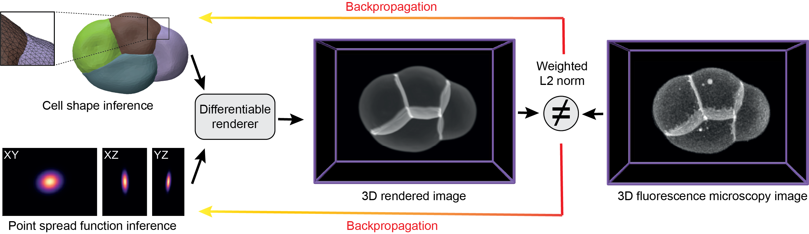

# *deltaMic*: differentiable Microscopy image creator
[](https://creativecommons.org/licenses/by-sa/4.0/)
 
📄 Accepted at [ICCV 2025](https://iccv.thecvf.com)

***deltaMic*** is a PyTorch-based Python library for physically grounded cell shape inference from 3D fluorescence microscopy images. It formulates segmentation as an inverse problem, optimizing a deformable triangle mesh so that its synthetic fluorescence rendering matches the observed image.

<p align="center">

</p>

This library combines:

- A **differentiable Fourier transform** formulation for triangulated surfaces (**meshFT**),
- A simple physical model of 3D fluorescence microscopy using convolution with a point spread function (PSF),
- A **narrow-band Fourier filtering scheme** that restricts computation to physically meaningful frequencies, dramatically reducing runtime without loss of accuracy,
- **GPU-accelerated** C++/CUDA backends for efficient forward and backward passes,
- A **fully differentiable** rendering pipeline built on PyTorch’s autograd engine.

`deltaMic` supports both CPU and GPU execution, enabling scalable, end-to-end optimization of mesh geometry and optical parameters.

# Table of Contents
- [Installation](#installation)
- [Usage](#usage)
  - [Interactive Jupyter Notebooks](#interactive-jupyter-notebooks)
  - [Command Line Examples](#command-line-examples)
  - [Plug-in Example: Mesh to Image (Console)](#plug-in-example-mesh-to-image-console)
  - [API and Documentation](#api-and-documentation)
    - [Fourier\_transform](#fourier_transform)
    - [PSF design](#psf-design)
    - [Rendering](#rendering)
- [📖 Citations](#-citations)
- [License](#license)

---

## Installation

After cloning the repository:

```bash
cd <path_to_folder>/deltamic
pip install -r requirements.txt
python setup.py install
```

---

## Usage

### Interactive Jupyter Notebooks

- `./Examples/Gradient_Descent.ipynb`  
  Demonstrates gradient descent to fit a spherical mesh to a 3D image (e.g., cow).  
  Try other sample images in `./data/image/` (bunny, duck, fish, etc.).

- `./Examples/Gradient_Descent_cpu.ipynb`  
  CPU-compatible version of the above notebook.


### Command Line Examples

- Fit to mesh:  
  ```bash
  python run_GD_obj.py --gt_mesh_path "data/mesh/fish.obj" --result_folder "Results_fish/"
  ```
  Optimizes a spherical mesh to match a ground truth mesh in .obj format.

- Fit to image:
  ```bash
  python run_GD_obj.py --init_mesh_path "data/mesh/bunny.obj" --gt_img_path "data/image/cow.tif" --result_folder "Results_bunny2cow/"
  ```
  Optimizes a spherical mesh to match a 3D .tif image.

- Time-lapse shape evolution:
  ```bash
  python run_GD_rec.py --gt_path "data/image/Sample01_008.tif/" --mesh_path "data/mesh/Sample01_007.rec" --result_folder "Results_Sample01_007_to_008/"
  ```
  Evolves a mesh from time t to match image at t+1 (with 1000 steps)
  
- Batch execution:
  ```bash
  bash run_batch.sh
  ```   
  Runs multiple deltaMic experiments with user-defined arguments, useful for dataset-wide evaluation.


### Plug-in Example: Mesh to Image (Console) 

Loads a mesh and renders a microscopy image:
```py
from deltamic import normalize_tensor,render_image_from_ftmesh,Fourier3dMesh,compute_box_size,generate_gaussian_psf
import trimesh
import numpy as np
import torch

# Creation of initial configurations: 
device = 'cuda:0'
box_shape = np.array([200]*3)
filename = "data/spot.obj"

Mesh_gt = trimesh.load(filename)
faces = np.array(Mesh_gt.faces)
verts = np.array(Mesh_gt.vertices)
box_size = torch.tensor(compute_box_size(verts, offset = 0.2))

Verts = torch.tensor(verts, dtype = torch.float, device = device,requires_grad = True)
Faces = torch.tensor(faces, dtype = torch.long, device = device)
Faces_coeff = torch.ones(len(Faces),dtype = torch.float, device = device)

print("Vertices shape: ",verts.shape,"Faces shape: ", faces.shape)
print("Min/Max x/y/z position of vertices: ",verts.min(axis=0),verts.max(axis=0))
print("box_size: ",box_size, "box_shape",box_shape)

narrowband_thresh = torch.tensor(1e-5,dtype = torch.float, device = device)
meshFT = Fourier3dMesh(box_size,box_shape,device=device, dtype = torch.float32)
sigma_matrix = (1e-3*torch.eye(3,device=device))
OTF = generate_gaussian_psf(sigma_matrix,meshFT.xi0,meshFT.xi1,meshFT.xi2).to(device)

# Image creation:
ftmesh = meshFT(Verts,Faces, Faces_coeff)
image_ft=normalize_tensor(render_image_from_ftmesh(ftmesh, OTF, box_shape))

# Backward pass
loss = torch.sum(image_ft)
loss.backward()
print(Verts.grad)

# Visualize image
import napari
v = napari.view_image(image_ft.detach().cpu().numpy())
```


### API and Documentation

#### Fourier_transform
First we need to build our torch.nn function:
- `class Fourier3dMesh(self, box_size,box_shape,device = 'cpu', dtype = torch.float,OTF=None narrowband_thresh = 0.01)`: 
    - `box_shape: [x_res,y_res,z_res]` Size of the Fourier transform box (in voxels)
    - `box_size:[[x_min,xmax],[y_min,y_max],[z_min,z_max]]` Dimensions of the box (in the spatial dimensions of the mesh)
    - `narrowband_thresh` threshold under which frequencies are not computed
    - `OTF` Optical transfer function, i.e Fourier transform of the PSF. Used to do the narrow-band computation.
    - `return meshFT`, a PyTorch autodiff function that compute the Fourier transform of a triangle mesh in the given box.
    

#### PSF design

We provide differentiable implementations of different PSFs. Parameters such as PSF width, refraction indices, optical aberrations (i.e Zernike polynomial coefficients), can be learned during the optimization. See example notebooks for real use-cases. 
- `Gaussian_psf(self, box_shape,box_size,sigma=1, device = 'cpu')`: Implements a differentiable gaussian PSF
- `Gibson_Lanni_psf(self,box_shape, device = 'cpu', **kwargs)`: Implements a differentiable Gibson-Lanni PSF
- `Hanser_psf(self,box_shape,xi0,xi1,xi2, device = 'cpu', **kwargs)`: Implements a differentiable single-objective PSF by computing the pupil function
Differentiable parameters of PSFs models can be conveniently obtained with the method `model.parameters()`


#### Rendering
Our rendering function takes the Fourier transform of the mesh `ftmesh` and the optical transfer function `OTF` and returns an image of size `box_shape`.

- `render_image_from_ftmesh(ftmesh,OTF,box_shape)`:
    - `return image`, a 3D image of size `box_shape`

---

## 📖 Citations

If you use this library in your research, please cite:

```bibtex
@inproceedings{ichbiah2025inverse,
  title={Inverse 3D microscopy rendering for cell shape inference with active mesh},
  author={Ichbiah, Pierre and Sinha, Anshuman and Delbary, Fabrice, and Turlier Herv{\'e}},
  booktitle={Proceedings of the IEEE/CVF International Conference on Computer Vision (ICCV)},
  year={2025}
}
```

## License  

This work is licensed under a  [Creative Commons Attribution-ShareAlike 4.0 International License](https://creativecommons.org/licenses/by-sa/4.0/).  

[](https://creativecommons.org/licenses/by-sa/4.0/)  

